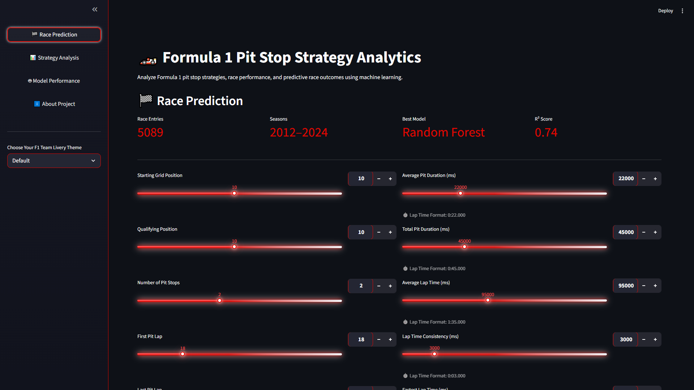
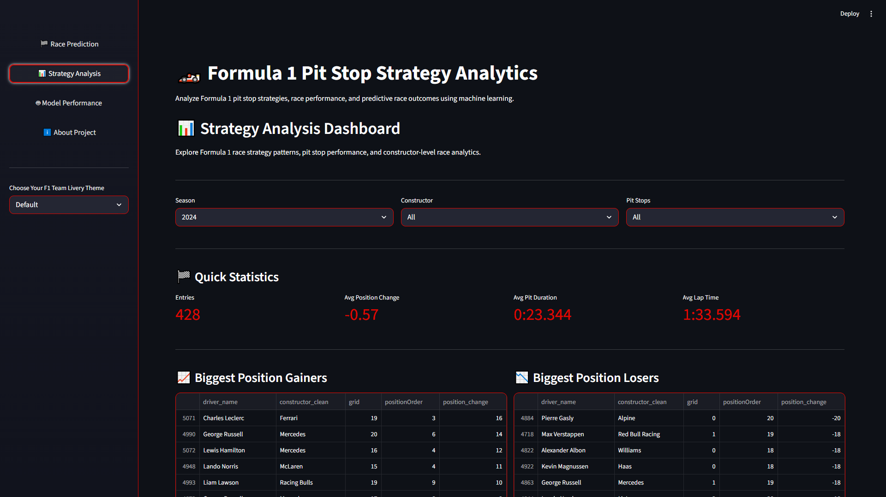
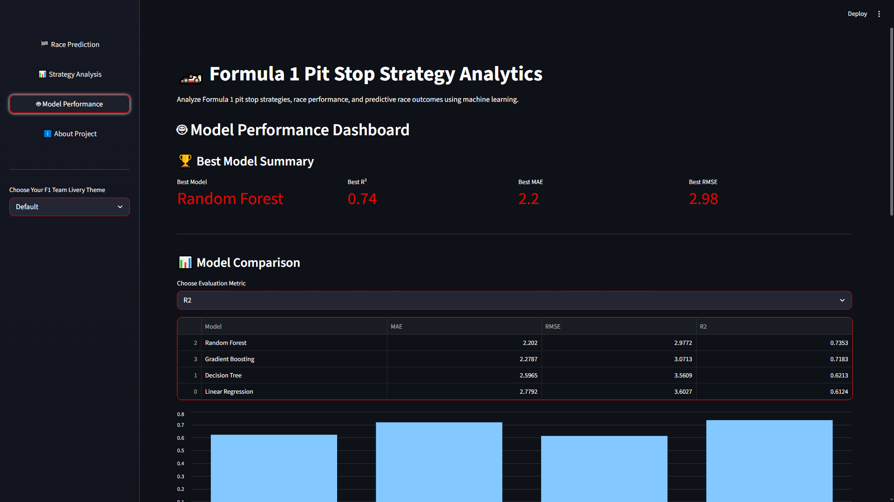

# Formula 1 Strategy Analytics and Position Delta Prediction

An interactive machine learning and analytics platform for predicting Formula 1 finishing position delta using race strategy and performance variables.

This project combines historical Formula 1 race data, feature engineering, supervised machine learning, and an interactive Streamlit dashboard to analyze how qualifying performance, pit stop strategy, lap consistency, and race pace influence race outcomes.

---

# Table of Contents

1. [Research Question](#research-question)  
2. [Dataset](#dataset)  
3. [Methodology](#methodology)  
4. [Engineered Features](#engineered-features)  
5. [Machine Learning Models](#machine-learning-models)  
6. [Results](#results)  
7. [Interactive Dashboard](#interactive-dashboard)  
8. [Dashboard Preview](#dashboard-preview)  
9. [Project Structure](#project-structure)  
10. [Installation](#installation)  
11. [Running the Streamlit App](#running-the-streamlit-app)  
12. [Running the Jupyter Notebook](#running-the-jupyter-notebook)  
13. [Key Technologies](#key-technologies)  
14. [Future Work](#future-work)  
15. [Author](#author)  
16. [License](#license)  

---

# Research Question

> To what extent can Formula 1 strategy and race-performance variables predict a driver's finishing position delta?

In this project, **position delta** is defined as:

```text
Position Delta = Starting Grid Position − Final Finishing Position
```

- Positive values indicate positions gained during the race  
- Negative values indicate positions lost during the race  

---

# Dataset

This project utilizes historical Formula 1 data sourced from the Kaggle Formula 1 World Championship dataset (1950–2024).

The final analytical dataset was constructed by merging:

- Race results  
- Qualifying results  
- Pit stop records  
- Lap timing data  
- Constructor information  
- Driver information  

Data preprocessing included:

- Missing value handling  
- Constructor name normalization  
- Pit stop outlier filtering  
- Feature aggregation and engineering  

---

# Methodology

The machine learning pipeline consists of:

1. Multi-source dataset construction  
2. Data preprocessing and cleaning  
3. Feature engineering  
4. Exploratory data analysis (EDA)  
5. Supervised machine learning regression  
6. Interactive dashboard deployment  

---

# Engineered Features

Key predictive features include:

- Starting grid position  
- Qualifying position  
- Number of pit stops  
- First, last, and average pit lap  
- Average pit stop duration  
- Total pit stop duration  
- Average lap time  
- Fastest lap time  
- Lap time consistency  
- Total laps completed  

---

# Machine Learning Models

The following regression models were evaluated:

- Linear Regression  
- Decision Tree Regression  
- Random Forest Regression  
- Gradient Boosting Regression  

Models were evaluated using:

- Mean Absolute Error (MAE)  
- Root Mean Squared Error (RMSE)  
- R² Score  

---

# Results

Random Forest Regression achieved the strongest predictive performance, indicating that Formula 1 race outcomes are driven by highly nonlinear interactions between race strategy and performance variables.

Key findings include:

- Qualifying performance strongly influences race outcomes  
- Pit stop execution contributes substantial predictive information  
- Lap consistency is highly associated with favorable race performance  
- Ensemble models outperform traditional linear approaches  

---

# Interactive Dashboard

The project includes a fully interactive Streamlit dashboard for real-time strategy exploration and predictive analytics.

Dashboard capabilities include:

- Predicting finishing position delta  
- Constructor-level strategy analysis  
- Interactive race strategy simulation  
- Model comparison and evaluation  
- Feature importance visualization  
- Historical performance exploration  

---

# Dashboard Preview

## Race Prediction Dashboard


## Strategy Analysis Dashboard


## Model Performance Dashboard


---

# Project Structure

```text
F1-Pit-Strategy-Analysis/
│
├── app/
│   └── streamlit_app.py
│
├── data/
│   └── processed/
│   └── raw/
│
├── figures/
|
├── images/
|
├── models/
│
├── notebooks/
│   ├── exploratory_analysis.ipynb
|
├── src/
│   ├── pages/
|   |   └── about.py
|   |   └── model_performance.py
|   |   └── race_prediction.py
|   |   └── strategy_analysis.py
|   |
│   ├── config.py
│   ├── data_utils.py
│   ├── formatting.py
│   ├── styles.py
│   └── ui_components.py
│
├── requirements.txt
├── requirements-dev.txt
└── README.md
```

---

# Installation

Clone the repository:

```bash
git clone https://github.com/thomaschung1/F1-Pit-Strategy-Analysis.git
cd F1-Pit-Strategy-Analysis
```

## Running the Streamlit App

```bash
pip install -r requirements.txt
streamlit run app/streamlit_app.py
```

## Running the Jupyter Notebook

```bash
pip install -r requirements-dev.txt
jupyter notebook
```

---

# Key Technologies

- Python
- Streamlit
- Pandas
- NumPy
- Scikit-learn
- Matplotlib
- Seaborn
- Machine Learning
- Sports Analytics

---

# Future Work

Potential future improvements include:

- Telemetry-level integration
- Sequential time-series modeling
- Reinforcement learning race simulations
- Live race strategy analytics
- SHAP-based model explainability
- Tire compound and weather integration

---

# Author

Thomas Chung

---

# License

This project is intended for academic and educational purposes.

